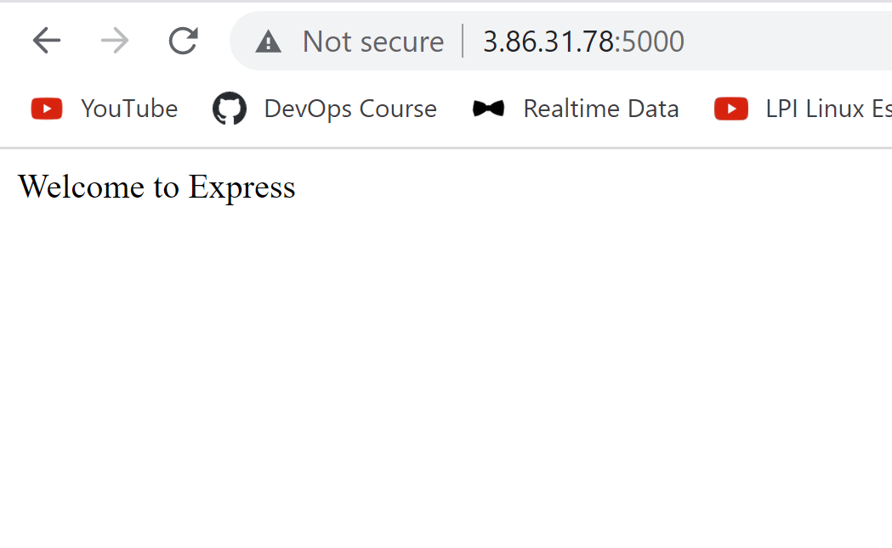

# Project 3 MERN STACK Deployment

## connect to EC2 instance and begin work using windows terminal or Git Bash

## update and upgrade ubuntu repo by running commands below

`sudo apt update`

`sudo apt upgrade`

## Get location of Node.Js software from Ubuntu repo using the code below

`curl -fsSL https://deb.nodesource.com/setup_18.x | sudo -E bash -`

## install NodeJs on server using the code below

`sudo apt-get install -y nodejs`

## very node installation using the code below

`node -v `

`npm -v `

## Create directory for the todo project

`mkdir Todo`

## opportunity to check more info about file using the ls command and others

`ls -lih`

## change directory to the newly created directory using the code below

`cd Todo`

## carry out initial setup of node js components using the code below

`npm init`

## confirm files created by typing ls command in the terminal

## setup ExpressJs for route of the built application using http methods and URL. install expressJs using the code below:

`npm install express`

## also create file index using the command below. and install the dotnv module using the after creating the file

`touch index.js`

`npm install dotenv`

## check to see if server is running on port 500

## try to access express site from the url at port 5000

## use API verbs for management of Task creation, retrieval and DELETION using POST, GET and DELETE

## Also create end points (use of ExpressJS) that the to do app will depend 

## create route directory for the endpoints 

## install nodejs package for mongoDB interaction in the parent folder todo

`npm install mongoose`

## create file api and update the file with the code

## we can then setup the MODELS for mongoDB setup

## setup a free account of mongodb and follow the necessary steps to setup and also create a hidden .env file and update the connection string to the DB.

## update the index.js file to reflect the use of .env file.

## start the server using the information below

`node index.js`

## should get the response Dataabse connected succesfuly

## backend setup now complete. test this with a RESTful API using POSTMAN

## carry out POST of data using POSTMAN

## carry out a GET of the data posted using POSTMAN

## Try to see how to delete by using the ID following the backward slash  to the url 

## with this task backend is now succesful.

## start frontend APP

## Run command below to setup frontend app, this will also create a folder to add all react code

` npx create-react-app client`

## setup dependencies for REACT APP. setup concurrently and nodemon using the codes below

`npm install concurrently --save-dev`

`npm install nodemon --save-dev`

## ensure the package.json files are updated correctly in the Todo and client folder. after the update run the code below for proper setup of the app

`npm run dev`

## ensure your EC2 instance is opened to access on port 3000 and try to connect to it from a web browser.

## create the necessary directories before setting up the AXIOS too which is a promised based http client

## setup the necessary json, css, app files and run the code below to access the appliaction

`npm run dev`

## Access the toDo app using the web url

## with this the MERN STACK has been deployed after setting up  the frontend to communicate with the Node server using ExpressJs and a DATABSE also been available to run task 

